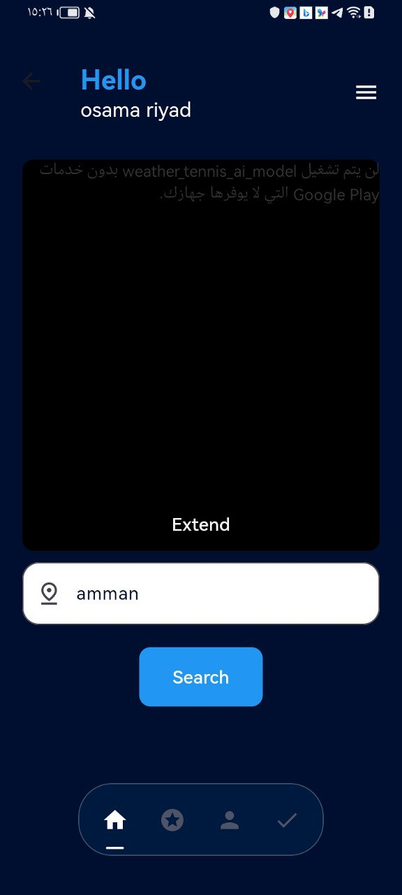

# Weather-AI 🌦️🤖

## Description  
Weather-AI is a Flutter-based mobile application that provides real-time weather updates with a **Clean Architecture** approach, ensuring scalability and maintainability. The app delivers accurate forecasts, detailed weather insights, and interactive features for user convenience.  

Key highlights include:  
- **Real-time weather updates** via APIs  
- **AI-driven predictions** for enhanced forecast accuracy  
- **Secure authentication** for user privacy  
- **Cubit state management** for efficiency  
- **Layered architecture** for better testability and scalability  
- **Modern and user-friendly UI** for an optimal experience  

## Features  
✅ **Authentication** – Secure login and registration  
✅ **Home Screen** – Displays real-time weather and temperature updates  
✅ **AI Predictions** – Intelligent weather forecasting using AI models  

## Technologies Used  
- **Flutter** (Dart)  
- **Cubit** for state management  
- **REST APIs** for real-time weather data  
- **Firebase** (if used for authentication or backend)  
- **AI/ML Models** for weather predictions (if applicable)  

## ScreenShots

### Splach Screen


### Auth Screen


### Sign Up Screen 


### Home Screen 


### Weather&Prediction Screen


1. Clone the repository:  
   ```bash
   git clone https://github.com/Osamariyad2003/weather-ai-model.git

